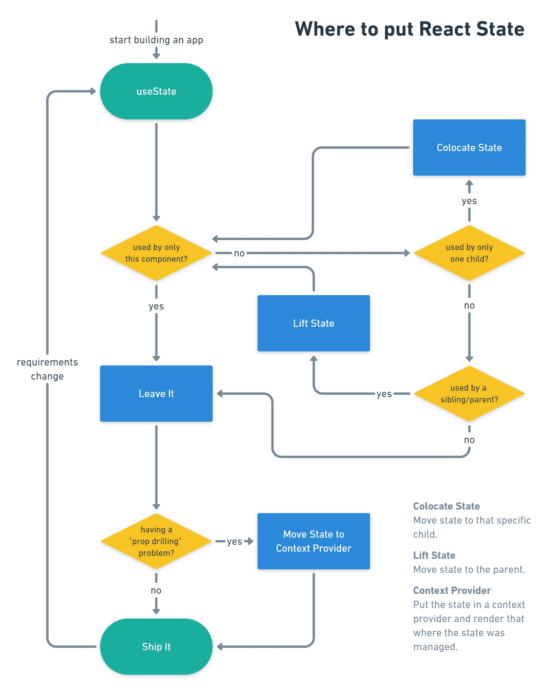
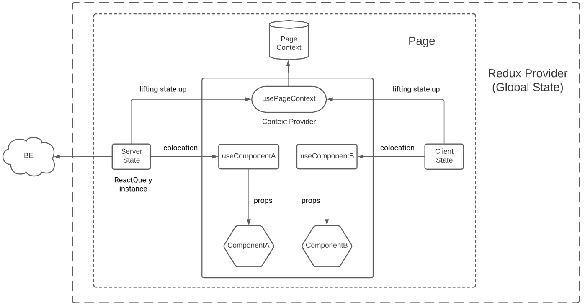
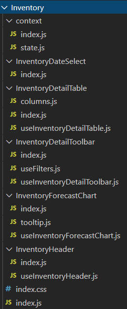
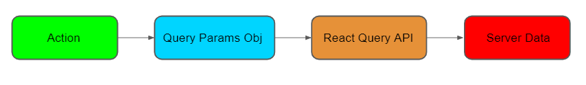
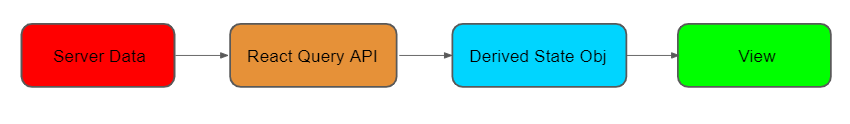

## Table of Contents

-   [Concepts](#concepts)
    -   [Colocate State](#colocate-state)
    -   [Lift State](#lift-state)
    -   [Client State](#client-state)
    -   [Server State](#server-state)
        -   [React Query as a server state manager](#react-query-as-a-server-state-manager)
    -   [Rules of Hooks](#rules-of-hooks)
    -   [State Derivation](#state-derivation)
        -   [Memoization](#memoization)
-   [State Management](#state-management)
    -   [Global State](#global-state)
    -   [Page State](#page-state)
        -   [Context Object](#context-object)
        -   [Context Provider Component](#context-provider-component)
        -   [Context Consumer Hook](#context-consumer-hook)
        -   [Context setup](#context-setup)
    -   [Server State Handling](#server-state-handling)
        -   [Request](#request)
        -   [Response](#response)
-   [Components Structure](#components-structure)
    -   [Presentational Components](#presentational-components)
    -   [Custom Container Hook](#custom-container-hook)
-   [Pitfalls and Guidelines](#pitfalls-and-guidelines)

# Concepts

### Colocate State

This means moving the state as close to where we need it as possible, especially if we have a lot of unnecessary state in parent components.

### Lift State

Often, several components need to reflect the same changing data. React docs recommends lifting the shared state up to their closest common ancestor.

Start developing our application with `local-state-first-approach`([co-location](https://kentcdodds.com/blog/colocation)). If we find ourself in a need to share state between unrelated components — extract the local state to a context and see how it goes. Let's see this [graph](https://kentcdodds.com/blog/state-colocation-will-make-your-react-app-faster).

<p align="center">
	
</p>

## Client State

-   **Non-Persistent between sessions:** It's temporary and local and generally Non-Persistent between sessions
-   **Synchronous:** It's access to a synchronous API that don't have any latency
-   **Client-owned:** Most of it is owned by our clients application instance
-   **Reliably Up to date**

## Server State

-   **Remotely Persisted:** so the location and source of truth for our service state is potentially unknown or at least outside of our control
-   **Asynchronous:** We have to access it with asynchronous API's
-   **Shared Ownership:** it's not just owned by our client, it can be read and manipulated by both the server and any other potential clients that interact with it
-   **Potentially Out of Date**

**Challenges:**

-   Caching
-   Deduping Requests
-   Background Updates
-   Outdated Requests
-   Mutation
-   Pagination / Incremental Fetching
-   Garbage Collection / Error Memory management

### React Query as a server state manager

> React Query is often described as the missing data-fetching library for React, but in more technical terms, it makes fetching, caching, synchronizing and updating server state in your React applications a breeze, [React Query](https://react-query.tanstack.com/docs/overview)。

In React Query we have queries and mutations:

#### Queries

Used to get data from the server service.

To make a new query, call `utils/hooks/useGet.js` hook with at least:

-   A unique key for the query
-   The endpoint of the Server service
-   A declarative Query Object

Example:

```jsx
const availableYearsApi = useGet(
	'available_years',
	'/api/v2/almanac/choices/sales_overview2_available_years',
	{ fyear, agg_type }
);
```

-   Dependent (or serial) Queries: queries that depend on previous ones to finish before they can execute. To do this, use the enabled option to tell a query when it is ready to turn on:

```jsx
// Get the user
const userApi = useGet('user', '/api/v2/user_info', { email });

// Then get the user's projects
const projectsData = useGet(
	'projects',
	`/api/v2/projects/${userApi.response?.id}`,
	{
		// `userApi.response` would be `null` at first (falsy),
		// so the query will not execute until the user exists
		enabled: userApi.response,
	}
);

// isIdle will be `true` until `enabled` is true and the query begins to fetch.
// It will then go to the `isLoading` stage and hopefully the `isSuccess` stage :)
```

-   Enable/Disable queries: see an example [here](../src/pages/planning/Sales/Overview/context/index.js).

```jsx
/** Available Weeks Request **/
const availableWeeksApi = useGet(
	'available_weeks',
	'/api/v2/almanac/choices/sales_overview2_available_weeks',
	{ fyear },
	{ enabled: agg_type === 'WEEKLY' }
);

/** Available Months Request **/
const availableMonthsApi = useGet(
	'available_months',
	'/api/v2/almanac/choices/sales_overview2_available_months',
	{ fyear, agg_type: agg_type_for_available_months },
	{ enabled: agg_type !== 'WEEKLY' }
);
```

#### Mutations

Used to create/update/delete data from a server service.

## Rules of Hooks

Before we create our own Hook, let's review a few of the major rules we must always follow.

-   Never call Hooks from inside a loop, condition or nested function
-   Hooks should sit at the top-level of your component
-   Only call Hooks from React functional components
-   Never call a Hook from a regular function
-   Hooks can call other Hooks

# State Management

<p align="center">
	
</p>

## Global State

It's data shared to the whole application via Redux / Redux-Saga.

-   User Information
-   Retailer Information
-   Accesses
-   Authentication State
-   Pusher Channels state (Notifications)

## Page State

It's the data shared to certain page of the application via [React Context](https://kentcdodds.com/blog/how-to-use-react-context-effectively) API.
The first thing we’re going to do is to create a separate `context/index.js` file, where we're going to build the context object, the context provider component and the context consumer hook.

#### Context Object

First we will create a context object will store the state of the Page.

```jsx
const PageContext = React.createContext();
```

#### Context Provider Component:

This component provides the context defined above to the tree. Think of our Context Provider as globally accessible container for the page, inside of which we can put any state and functions we want.

Here we initialize:

1.  **Client State** which will be used across the page. I recommend to use the `Reducer State Pattern` (as Redux does) which allows us greater control of our state changes.

```jsx
const [state, dispatch] = React.useReducer(reducer, initialState);
```

The `initialState` and `reducer` are defined in `context/state.js`

```jsx
export const initialState = {
	start_offset: -6,
	end_offset: 5,
	agg_type: {
		label: 'Monthly (Fiscal)',
		value: 'MONTHLY',
	},
};

export function reducer(state, { type, payload }) {
	switch (type) {
		case 'CHANGE_PAGE':
			return {
				...state,
				currentPage: payload.currentPage,
				rowsPerPage: payload.rowsPerPage,
			};
		case 'SET_START_OFFSET':
			return {
				...state,
				start_offset: payload,
			};
		}
	}
}
```

2. Instances of **Server State** which will be used across the page.

```jsx
// We create instances of React Query to handle the state of certain BE services

/** Available Years Request **/
const availableYearsApi = useGet(
	'available_years',
	'/api/v2/almanac/choices/sales_overview2_available_years',
	{ agg_type }
);

/** Available Weeks Request **/
const availableWeeksApi = useGet(
	'available_weeks',
	'/api/v2/almanac/choices/sales_overview2_available_weeks',
	{ fyear },
	{ enabled: agg_type === 'WEEKLY' }
);
```

3. **Side Effects**: only for those cases where we need that a certain value of the Client State needs to be synchronized with values that come from the server.
   I recommend avoiding as much as possible the proliferation of useEffect within the Context Provider. Using it as a last resort.

```jsx
React.useEffect(() => {
	// obtaining current date
	if (data) {
		dispatch({
			type: 'SET_ACTIVE_DATE',
			payload: {
				offset: 0,
				year: data.fyear || null,
				month: data.fmonth || null,
			},
		});
	}
}, [data]);
```

4. **Actions** (for Client State only)

```jsx
function onChangeYear(option) {
	dispatch({ type: 'SET_CHANGE_ACTIVE_YEAR', payload: option });
}

function onChangeTimeInterval(option) {
	dispatch({ type: 'CHANGE_TIME_INTERVAL', payload: option });
}
```

5. **Selectors** and **Derived values** from Server State (memoized most of them)

```jsx
// Selectors from Client State
const isDollars = metricValue.value === 'revenue';
const fyear = state.activeDate.year;

// Derived values from Server State (memoized most of them)
const availableYears = React.useMemo(() => {
	const availableYears = availableYearsApi.response.results.map((year) => ({
		label: year.fyear.toString(),
		value: year.fyear,
	}));

	return availableYears;
}, [availableYearsApi.response.results]);
```

6.  **Query objects** used by the Server State instances across the app (**must be memoized**).

```jsx
const queryParams = React.useMemo(() => {
	return {
		source_type,
		agg_tab,
		start_offset,
		end_offset,
		agg_type,
	};
}, [agg_tab, agg_type, end_offset, source_type, start_offset]);
```

7. **Functions or variables** that can be used by the points mentioned above

Finally, assign all this to the Provider component

```jsx
// this object store all points mentioned above
const data = {
	detailQueryParams,
	chartQueryParams,
	metricValue,
	agg_type,
};

// the provider shares the value with the tree
return (
	<PageContext.Provider value={data}>{props.children}</PageContext.Provider>
);
```

What we pass to the value prop above is going to be made accessible from anywhere deep in our page.

#### Context Consumer Hook:

This custom hook will use `React.useContext` to get the provided context value from the Context Provider.

```jsx
export function usePageContext() {
	const context = React.useContext(PageContext);

	if (!context) {
		throw new Error(`usePageContext must be used within a PageContext`);
	}

	return context;
}
```

**IMPORTANT**: This hook can only be executed within any component that is in the tree that the provider wraps.

#### Context setup:

What’s left is to bind this context to the page, a.k.a to "provide" the page with context (that's why it's called ContextProvider).

```jsx
import React from 'react';
import { PageContextProvider } from './context';
import PageForecastChart from './PageForecastChart';
import PageTable from './PageTable';
import './index.css';

export default function Page() {
	return (
		<PageContextProvider>
			<div>
				<PageForecastChart />
				<PageTable />
			</div>
		</PageContextProvider>
	);
}
```

Now let’s use the context that we have provided.

```jsx
import React from 'react';
import { usePageContext } from '../context';

export default function PageTable() {
	const { metricValue, agg_type } = usePageContext();

	return (
		<div>
			{metricValue}
			{agg_type}
		</div>
	);
}
```

# Components Structure

<p align="center">
	
</p>

In the root should be a folder with the name of the page. Below this should be the components that will be used on that page.

**IMPORTANT**: avoid nesting folders within folders and intermediate components. Ideally, each component has as its parent the root folder with the name of the page.

## Presentational Component

This a simple function component that consumes the info from it's respective custom hook. Avoid defining functions and variables here.

## Custom Container Hook

This custom hook provides functions, variables and Context to the presentational component. If the presentational component is called `PageTable`, the hook that provides the info should be called `usePageTable`. There should be only one main hook for each presentational component.

Expose only one way to provide the context value:

```jsx
import React from 'react';
import { usePageContext } from '../context';

export default function usePageTable() {
	const { activeTab, optionsTab, dispatch, tableData } = usePageContext();

	const onChangeTab = React.useCallback(
		(value) => {
			dispatch({
				type: 'CHANGE_TAB',
				payload: value,
			});
		},
		[dispatch]
	);

	return {
		optionsTab,
		activeTab,
		tableData,
		onChangeTab,
	};
}
```

... and only one way to consume it.

```jsx
import React from 'react';
import { Tabs } from 'uc-components';
import usePageTable from './usePageTable';

export default function PageTable() {
	const {
		optionsTab,
		activeTab,
		tableData
		onChangeTab,
	} = usePageTable();

	return (
			<Tabs tabs={optionsTab} active={activeTab} onChange={onChangeTab}>
				<div>
					{tableData}
				</div>
			</Tabs>
	);
}
```

This allow us to ensure that presentational component is using the context value the way it should be and it allow us to provide useful utilities for the
consumer.

Exceptional cases:

-   If the hook tends to be very large, then separate it into new mini custom hooks as abstraction allows.

# Server State Handling

## Request

<p align="center">
  
</p>

-   Action: the action triggered by the user updates Client State. This change in the state of the page forces React to perform a re-render

```jsx
const onChangeYear = React.useCallback(
	({ value }) => {
		dispatch({
			type: 'CHANGE_YEAR',
			payload: value,
		});
	},
	[dispatch]
);
```

-   Query Params Obj: every time a re-render occurs, this function will analyze if there was a change in the values of its dependencies and it will return a new updated value. If not, it will keep the previous value.

```jsx
const queryParams = React.useMemo(() => {
	return {
		year,
		agg_type,
	};
}, [year, agg_type]);
```

-   React Query API: the instance evaluates if there was any change in the Query Params Obj to fetch data from Server.

```jsx
const availableYearsApi = useGet(
	'available_years',
	'/api/v2/almanac/choices/sales_overview2_available_years',
	queryParams
);
```

## Response

<p align="center">
  
</p>

-   Derived State Object: when the `availableYearsApi` instance changes its state due to a response from the server, the function below will update and force a re-render.

```jsx
const availableYears = React.useMemo(() => {
	const availableYears = availableYearsApi.response.results.map((year) => ({
		label: year.fyear.toString(),
		value: year.fyear,
	}));
	return availableYears;
}, [availableYearsApi.response.results]);
```

-   View: the `availableYears` value will be passed via props to the presentational components of the ui that require it.

# Pitfalls and Guidelines

#### Overthinking performance

Avoid thinking in performance until you have serious issues regarding it. Know that React is fast by default and do some digging before applying performance optimizations pre-maturely.

#### When to useMemo and useCallback?

`useMemo` in query objects that will be passed to React Query instance (useGet) so that it's not re-executed unnecessarily. There is a particular scenario: the external `react-table` library requires that `columns` and `data` be memoized, therefore, `useMemo` needs to be applied there.

`useCallback` in scenarios when we want to keep the reference of certain function which have external dependencies and we need to pass it as prop to a child component.

Take into account that every abstraction (and performance optimization) comes at a cost. Those are all fine costs to incur if you get the performance benefits necessary, but it's best to measure first. Check [this](https://kentcdodds.com/blog/usememo-and-usecallback) awesome article from Kent C. Dodds for better understanding.

#### Activate ESLint plugin

`eslint-plugin-react-hooks` has two rules: "rules of hooks" and "exhaustive deps."
It's VERY important to install, use, and follow these rules. It will not only catch real bugs that you can easily miss, but it will also teach you things about your code and hooks in the process (not to mention the awesome auto-fix feature).

#### Custom hook vs Built-in hooks nomenclature

For custom hooks just `useSomething` but for React built-in hooks please use `React.useState`, `React.useCallback`, etc to diferentiate each other.

#### When hook file becomes huge...

If you see the hooks very huge, please feel free to create new files in the same folder that the hook is placed (colocation files).
[check this example](../src/pages/planning/Sales/Overview/OverviewDetailToolbar/useFilters).

#### Avoid create folders to store other components

Each component will have their own folder and should be placed in the root of the page to which it belongs without intermediaries/containers components.

#### Avoid prop drilling as much as you can

[Prop drilling](https://kentcdodds.com/blog/prop-drilling) is not an anti-pattern at all, but as the application grows, we may find ourself drilling through many layers of components and cpuld cause some real pain in the process of refactoring especially. The most common issue is renaming props halfway through (ie `<Toggle on={on} />` renders `<Switch toggleIsOn={on} />`) making keeping track of that in our brain difficult.
Remember to take advantage of using React context API and follow the [Lifting State](#lift-state)

#### Custom Container hooks are private

DO NOT use a Custom Container Hook into another component that is not for which it was designed. This is dangerous, because we are tying the business logic of one component with another. If you want to share props between components follow the [Lifting State](#lift-state)

#### Apply the AHA Programming principle

Prefer duplication over the wrong abstraction. Is cheapear copy/paste that do the wrong abstraction. Don't be panic to have large render methods.
